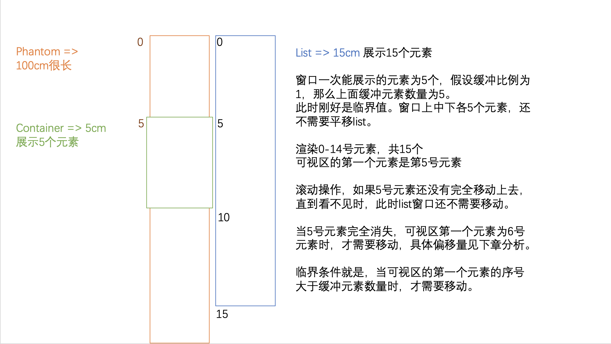
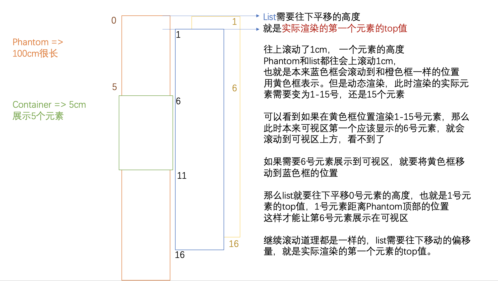

# 实现

虚拟列表，当数据量很大时，只加载可视区域内的内容。在滚动列表时进行计算，动态加载当前需要显示的内容。

## 布局

```html
<!-- 可视区域容器 -->
<div class="vs-container">
  <!-- 总列表高度 形成滚动效果 -->
  <div class="vs-phantom"></div>
  <!-- 动态渲染区域 -->
  <div class="vs-list">
    <!-- item-1 -->
    <!-- item-2 -->
    <!-- ...... -->
    <!-- item-n -->
  </div>
</div>
```

## 思路

列表滚动画图分析，全部完成后画图的，所以加上了缓冲区的数据。

通过图分析可以看到整个思路过程，主要就是获取两个值，一个就是可视区第一个元素的索引，一个就是 list 容器需要移动的距离。




### 列表项高度固定的情况

- startIndex 元素起始索引 注：是可视区元素的起始索引
- endIndex 元素结束索引
- screenHeight container 可视区域高度固定
- itemSize 列表每项高度固定
- listData 全部列表数据
- visiableData 动态展示在可视区的数据
- scrollTop 通过监听 scroll 事件获取到的 container 内部子元素滚动的距离

那么可以计算出如下数据：

- 列表总高度 `listHeight = listData.length \* itemSize`
- 可显示的列表项数 `visibleCount = Math.ceil(screenHeight / itemSize)`
- 数据起始索引 `startIndex = Math.floor(scrollTop / itemSize)`
- 数据结束索引 `endIndex = startIndex + visibleCount`
- 列表显示数据 `visibleData = listData.slice(startIndex, endIndex)`
- 偏移量 `startOffset = scrollTop - (scrollTop % itemSize)`

#### 偏移量分析

前面的图中可视化展示了整体思路过程。再用文字描述一遍。

phantom 和 list 作为 container 的子元素，当向上滚动时，会一起往上平移，那么首先序号为 0 的元素就会往上平移直到看不见，这时候可视窗口能看到的第一个元素是序号为 1 的元素。动态渲染就是看不见的元素不渲染，从需要展示在窗口的元素开始渲染。那么此时需要从序号 1 开始渲染，但是 phantom 整体的高度还是往上平移了序号 0 元素的高度，导致序号 1 元素就会显示在序号 0 元素的位置。那么在从序号 1 开始渲染的同时，需要把 phantom 往下平移序号 0 元素的高度，这样序号 1 元素才会显示在可视区域。

当滚动小于一个 itemSize 时，可以看到此时 list 还不需要平移，只有当一个项完全消失时，此时才需要往下平移一个项的高度。

在每项列表高度固定的情况下，list 需要移动的高度值为：`startOffset = scrollTop - (scrollTop % itemSize)`。也就是能够整除 itemSize 的高度，被卷上去了几个 itemSize 的高度。

那么，在滚动 container 时，监听滚动事件，拿到 scrollTop，更新 startIndex，以更新 visibleData。同时计算出 startOffset，将 list 进行平移，那么第一版虚拟滚动列表就完成了。代码见 VirtualScroll-v1.vue。

#### 增加缓冲区

当滚动快时，可能会出现白屏，那么此时需要在刚好渲染可视区的元素前后再加一部分元素用于缓冲。

定义 bufferScale 表示缓冲区比例。bufferScale 为 1，也就是说，前后各自多渲染一倍的数据。

比如可视区显示 10 条，那么当渲染到第 11 条数据时，前面 10 条还会在，中间显示 10 条，后面还有渲染 10 条。

aboveCount 表示上面多渲染多少条，当 startIndex 大于 10 时，为 10，小于 10 时，就是 startIndex，所以是两者之间的最小值

belowCount 表示下面多渲染多少条，当 endIndex 大于 10 时，为 10，小于 10 时，取 endIndex，同样取两者之间的最小值。

那么 visibleData 就是范围就扩大为，原来的 startIndex 减去 aboveCount，原来 endIndex 加上 belowCount。

startOffset，当滚动到超出 aboveCount 的高度时，才需要移动。否则上面的内容保留着。

VirtualScroll-v2.vue 在 v1 的基础上加上缓冲区，并修改写法。

### 列表项高度不固定的情况

同时考虑缓冲区实现

#### 实现思路

把 itemSize 换成 estimatedItemSize，预估高度，由用户传入。

定义 positions 数组，用于存储每一项的高度数值。列表还没有渲染时按照用户传入的 listData 和 estimatedItemSize 计算出一个预估值存入。

```js
this.positions = this.listData.map((item, index) => {
  return {
    index,
    height: this.estimatedItemSize, // 该项高度
    top: index * this.estimatedItemSize, // 该项顶部距离列表顶部距离
    bottom: (index + 1) * this.estimatedItemSize, // 该项底部距离列表顶部距离
  };
});
```

estimatedItemSize 只是用来计算用的，实际 item 初始时并没有通过 css 设置高度，是在 item 元素渲染后由渲染内容撑开高度。

不论是在初始化还是在滚动过程中，在 updated 钩子函数中 item 内容已经渲染成 DOM 了，这时候通过`this.$refs.items`，能拿到生成的 DOM 数组，也就知道了元素的真实高度。这时候去更新 positions 数组的值。用于后续计算。

因为一次只渲染一部分 DOM，比如一开始只渲染了 10 个 DOM 结构，所以只有前 10 个的值更新为了真实高度。

滚动时，DOM 更新了，又会触发 updated 函数，所以要给每个 nodes 一个 id，从这个 id 开始之后的元素才需要更新，前面的已经更新过了。

当滚动到末尾时，再往前滚动，如果数据不变，就不需要再计算了。

#### 数据计算方式变化

由于 itemSize 变成了 estimatedItemSize，数据渲染之后才知道真实高度，因此数据计算方式变了。

phantom 虚拟列表总高度，就是表格中最后一项的 bottom。

startIndex，找到 bottom 位置大于 scrollTop 的元素，就是当前显示在可视区域的第一个元素。这里由于数组元素 bottom 值是递增的，用二分法可以加快查找速度。

startOffset，当滚动到 this.startIndex > this.aboveCount 时，需要平移的距离，是**实际渲染的第一个元素的 top 值**。结合图片分析过程即可理解。

在 v2 基础上，将上面几个相应的计算方式改一下，即可实现支持不定高度的 v3 版本。

# 总结

类似问题，通过画图把过程可视化，逻辑捋清楚，找到临界条件，偏移值如何计算，然后照着思路写代码就可以了。

# 资料

[「前端进阶」高性能渲染十万条数据(虚拟列表)](https://juejin.cn/post/6844903982742110216)
